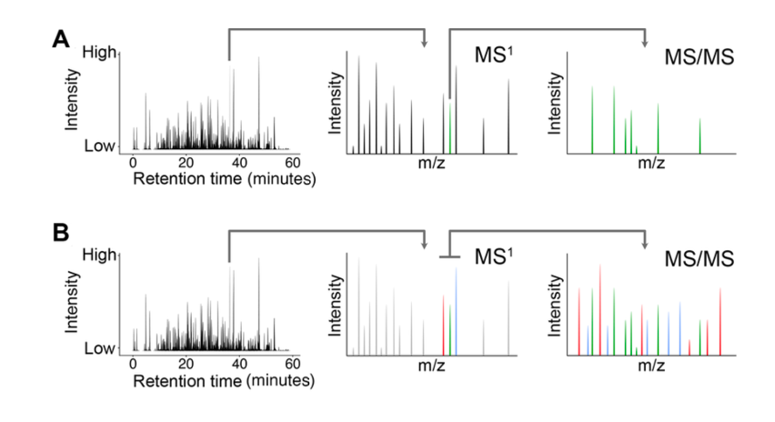
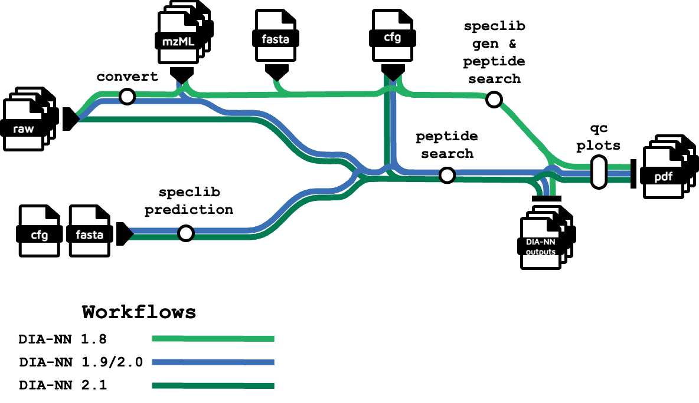

```{r libraries, message=FALSE, warning=FALSE, include=FALSE}
# Env set up
## Libraries
library(tidyverse)
library(arrow)
library(magrittr)
library(fs)
library(ggbeeswarm)
library(UpSetR)
library(arrow)
library(pheatmap)
library(viridis)
library(paletteer)
library(diann)
library(biomaRt)
library(clusterProfiler)
library(org.Hs.eg.db)
library(kableExtra)

## Colors for organisms
org_cols <- c(
  Ecoli    = "#007B53",
  Hsapiens = "#193F90"
)

## Overwrites all functions
select <- dplyr::select

## Extra set uo
set.seed(0)
setwd("~/Documents/EMBL_UniHD/mini-benchmark")
if (!dir.exists("plots")) dir.create("plots")
knitr::opts_knit$set(root.dir = "/Users/efra/Documents/EMBL_UniHD/mini-benchmark")


## Sources functions
### For computational metrics
source("scripts/comp_functions.r")
```


# Introduction
 
**Proteomics** is the quantitative study of the proteome, *i. e.*, the whole set of proteins available in a biological sample @Sinha2020. **Mass spectrometry** (MS) is the current state-of-the-art method to do proteomics analyses @Shuken2023. MS consists of measuring the **mass-to-charge ratio** ($m/z$) of ions @Glish2003.  MS tends to be combined with high-performance liquid chromatography (HPLC)@Sinha2020. Thus, in liquid chromatography-mass spectrometry (LC-MS), ions tend to be identified based on both their chromatographic retention time and $m/z$. In the case of MS-based proteomics, the ions to be analyzed are ionized peptides generated from enzymatic digestion @Sinha2020. 

Proteomics mass spectrometry consists of two steps. First, intact peptide ions (also called **precursors**) generate a first MS1 spectrum. Then a subset of them is subjected into **fragmentation**, generating a MS/MS spectrum. The fragmentation tends to break peptide bonds, thus the MS/MS aids into the identification of the peptide sequence @Shuken2023. 

There are two main data acquisition and quantification strategies: data-dependent acquisition (DDA) and data-independent acquisition (DIA),@Sinha2020 as shown in Figure \@ref(fig:data-acq). With the DDA strategy, a precursor is selected from MS1 at a given retention time to go into MS/MS. On the other hand, with the DIA strategy, multiple precursors are selected from a $m/z$ window of a given retention time to go into MS/MS.


```{r data-acq, echo=FALSE, fig.cap="Data acquisition strategies: DDA (A) and DIA (B). (Sinha & Mann, 2020)", fig.align='center', out.width='80%'}

```


The usage of DIA seems promising, as it allows the identification and quantification of peptide in an unbiased way @Frhlich2024. Besides, with the introduction of the new *Thermo Fisher Scientific Inc.*® instrument, the Orbitrap Astral mass spectrometer @Stewart2023, which is capable to quantify 5 times more peptides per unit time compared to other mass spectrometers compared to other DIA-based instruments @Heil2023, the area of proteomics seems to be advancing rapidly.

Nevertheless, there a lot of challenges in the computational aspect of the proteomics field, such as the data size and complexity, the prevalence of closed source software and restrictive licenses, the lack of good documentation, the lack of standardization in proteomics software development and the lack of maintenance of open source software @Perez-Riverol2025. For example, the mass spectrometers raw output files are in proprietary, licensed, closed and binary formats @Martens2005. Given the restrictive-access nature of these files, an open standard was needed, which is why the mzML @Deutsch2008 file format was created.

Another well-known problem in current science is the reproducibility crisis @Baker2016. Specifically, **computational reproducibility** is achieved when the same input data, code and software environment produce exactly the same output @Moreau2023. Nevertheless, this is not necessarily true across different computational platforms (i. e., different operating systems) due to intrinsic numerical instability @DITommaso2017. To address this issue, the use of containers is a popular solution in modern scientific computing @Moreau2023. Containers are a self-contained executable package isolated from the host system @Alser2024. Currently, the most used containerization technology is Docker @Merkel2014.

On the other hand, bioinformatics analyses are complex, multi-step processes that require the use of multiple specialized software tools in a chained sequence @Davis-Turak2017. Besides the reproducibility issue previously discussed, there are more challenges that the field is facing such as: incompatibilities between software, manual software execution steps, high complexity and file size of omics data, among others @Wratten2021. To tackle these problems, Nextflow @DITommaso2017 was developed both as a scientific workflow management system and domain specific language (DSL).

To assess this challenges, a Nextflow-based pipeline was to analyze both DDA and DIA proteomics data.
The objective of this notebook is to benchmark the DIA-specific subworfklows (Figure \@ref(fig:metromap)). The tools integrated into the subworkflow created to convert files from raw to mzML format were MSConvert @Chambers2012 and ThermoRawFileParser @Hulstaert2020. For DIA, DIA-NN @Demichev2020 processes and workflows were implemented. Docker images were built for all the DIA-NN versions available for Linux at the moment of the pipeline development (1.8.1, 1.9.1, 1.9.2, 2.0, 2.0.1, 2.0.2 and 2.1). Given incompatibilities across different DIA-NN versions, specific subworkflows for DIA-NN v1.8.1 and DIA-NN v2.1 were coded. Note that DIA-NN v2.1 accepts raw files as input, making the mzML conversion an unnecessary step. The DIA-NN steps are integrated as different Nextflow processes. In the end, the pipeline was built as modular as possible.


```{r metromap, echo=FALSE, fig.cap="Pipeline DIA-NN subworkflows metromap", fig.align='center', out.width='90%'}

```


DIA-NN is meant to be run in a multi-step pipeline following the next two steps:

* *In silico* spectral library prediction given a FASTA file with protein sequences, DIA-NN predicts a spectral library, which is a set of spectra with annotated information such as retention time and *m/z*.
* Analysis: DIA-NN analyze the raw data with the spectral library generated in the previous step.

Custom Docker images were created individually for most of the pipeline processes; except for the MSConvert conversion (`proteowizard/pwiz-skyline-i-agree-to-the-vendor-licenses`) and the ThermoRawFileParser conversion (`quay.io/biocontainers/thermorawfileparser:1.4.5--h05cac1d_1`). 

To benchmark the pipeline, samples from *Escherichia coli* and *Homo sapiens* were processed and measured by in three different mass spectrometer instruments: FusionLumos, Exploris480 and Astral. Three replicates were used per each combination (*i.e.* different mass spectrometers and the three species), yielding 18 different raw files. Different pipeline profiles were run considering the DIA-NN versions and raw file files processing strategies in a combinatorial way. 

To assess the computational efficiency of the pipeline runs, different metrics were considered and contrasted, such as the pipeline total runtime and the size of the input files.  In order to address the pipeline performance regarding biological metrics, the precursor identification and quantification results were measured.


# Computational  insights

To assess the computational efficiency of the pipeline runs, different metrics were considered and contrasted, such as the pipeline total runtime and the size of the input files. Data, including file size, from server after running
`ls -lh */*/data/*raw | tr -s ' ' '\t' > files_list.tsv` and then secure copying
it to the local repo root. The units were converted to MB using custom functions.


```{r raw-info, message=FALSE}
## Reads TSV
raw_info <- read_tsv("./files_list.tsv",
                     col_names = FALSE)

## Keeps just the necessary information
raw_info %<>% dplyr::select(c("X5", "X9")) %>% 
  purrr::set_names(c("size", "fullname"))

## Mutates the tibble
raw_info %<>% mutate(size_MB = get_MB(size)) %>% 
  separate(
    fullname,
    into = c("instrument", "organism", "subfolder", "file_name"),
    sep = "/"
  )

raw_info %>% 
  select(-file_name) %>% 
  kbl(
    caption = "Size of all raw files",
  ) %>% 
  kable_material(
    c("striped", "hover"),
    full_width = FALSE,
    position = "center"
  ) %>% 
  scroll_box(
    width = "80%",
    height = "400px",
    fixed_thead = TRUE
  )
```


As shown in Table \@ref(tab:median-instrument), the Astral instrument produces larger raw files than the other two instruments: the median file size was 0.76 GB for the FusionLumos, 1.14 GB for the Exploris480 and 9.6 GB for the Astral. 


```{r median-instrument, results='asis', fig.align='center', out.width='90%'}
### Median size by instrument
raw_info %>% 
  group_by(instrument) %>% 
  summarise(median(size_MB / 1024)) %>% 
  kbl(
    caption = "Median size by instrument",
    digits = 2
  ) %>% 
  kable_material(
    c("striped", "hover"),
    full_width = FALSE,
    position = "center"
  )
```


Besides, statistics were computed per organism. The *E. coli* reference proteome (UP000000625) has 4,403 genes, while the *H. sapiens* (UP000005640) one has 20,598. As shown in Table \@ref(tab:median-organism), the median raw file size for *E. coli* was 0.777 GB, while for *H. sapiens* it was 1.5 GB, almost twice as large. 


```{r median-organism, results='asis', fig.align='center', out.width='90%'}
### Median size by organism
raw_info %>% 
  group_by(organism) %>% 
  summarise(median(size_MB / 1024)) %>% 
  kbl(
    caption = "Median size by organism",
    digits = 2
  ) %>% 
  kable_material(
    c("striped", "hover"),
    full_width = FALSE,
    position = "center"
  )
```


The Figure \@ref(fig:size-plot) shows the file of the sizes per instrument and organism.


```{r size-plot, fig.cap="Size of raw files per experiment", fig.align='center', message=FALSE}
### Plot
ggplot(raw_info, aes(x = instrument, y = size_MB / 1024, colour = organism)) +
  geom_beeswarm(size = 2, alpha = 0.7) +
  scale_x_discrete(limits = c("FusionLumos", "Exploris480", "Astral")) +
  scale_colour_manual(
    name = "Organism",
    values = org_cols
  ) +
  theme_minimal() +
  ylim(0, 12.5) +
  labs(
    x = "Mass Spectrometer",
    y = "Raw file size (GB)"
  ) +
  ggtitle("Size of raw files per experiment")
```


To get the total runtimes, the [Nextflow workflow reports](https://www.nextflow.io/docs/latest/reports.html) were used. 
Times were summarized after doing `grep -m1 'duration: <strong>' */*/*/nf_report.html > runtimes.txt`. As expected, the data from Astral takes longer to be analyzed (Table \@ref(tab:runtimes-instrument)).


```{r runtimes-instrument, results='asis', fig.align='center', out.width='90%', message=FALSE, warning=FALSE}
## File parsing
runtimes <- read_delim("runtimes.txt",
                       delim =  "          ", ## By some reason grep created 10 whitespaces
                       col_names = FALSE) %>% 
  set_names(c("run", "string")) %>% 
  mutate(time = get_seconds(string) / 60,
         instrument = word(run, 1, sep = "/"),
         organism = word(run, 2, sep = "/"),
         profile = word(run, 3, sep = "/")) %>% 
  select(!run) %>% 
  select(!string)


### Median runtime per instrument
runtimes %>%
  filter(!str_detect(profile, "1\\.9\\.1")) %>%
  group_by(instrument) %>%
  summarise(median(time)) %>%
  kbl(
    caption = "Median runtime per instrument",
    digits = 2
  ) %>% 
  kable_material(
    c("striped", "hover"),
    full_width = FALSE,
    position = "center"
  )
```


Similarly, samples from *H. sapiens* also take longer (Table \@ref(tab:runtimes-instrument)).


```{r runtimes-organism, results='asis', fig.align='center', out.width='90%'}
### Median runtime per organism
runtimes %>%
  filter(!str_detect(profile, "1\\.9\\.1")) %>%
  group_by(organism) %>%
  summarise(median(time)) %>% 
  kbl(
    caption = "Median runtime per organism",
    digits = 2
  ) %>% 
  kable_material(
    c("striped", "hover"),
    full_width = FALSE,
    position = "center"
  )
```


The Figure \@ref(fig:runtimes-plot) shows the total runtimes of the pipeline per instrument and organism.


```{r runtimes-plot, message=FALSE, fig.cap="Total runtimes of the pipeline profiles across experiments", fig.align='center'}
### Plot
runtimes %>% 
  filter(!str_detect(profile, "1\\.9\\.1")) %>% 
  ggplot() +
  geom_beeswarm(aes(y = time / 60, x = instrument, colour = organism),
                size = 2,
                alpha = 0.8,
                ) +
  scale_colour_manual(
    name = "Organism",
    values = org_cols
  ) +
  geom_boxplot(aes(y = time / 60, x = instrument),
               width = .25, alpha = 0, 
               outlier.shape = NA) +
  scale_x_discrete(limits = c("FusionLumos", "Exploris480", "Astral")) +
  theme_minimal() +
  labs(
    x =  "Mass Spectrometer",
    y = "Total runtime (h)",
    title = "Runtime per experiment"
  )
```


As expected, there is a correlation between the size of the raw files and the total runtime of the pipeline, although this does not seem to be a linear correlation. Indeed, the pattern seems to be exponential, although more data would be needed to confirm that assumption.


```{r size-time, fig.cap="Pipeline runtimes vs size of raw files", fig.align='center', message=FALSE}
raw_summary <- raw_info %>%
  group_by(instrument, organism) %>%
  summarise(
    avg_raw_size = mean(size_MB, na.rm = TRUE),
    ## Cleans unnecessary metadata
    .groups  = "drop"
  ) %>% 
  ## Converts back to GB
  mutate(avg_raw_size = avg_raw_size / 1024)


size_time <- left_join(runtimes, raw_summary,
                       by = c("instrument", "organism"))


size_time %>% 
  filter(!str_detect(profile, "1\\.9\\.1")) %>% 
  ggplot(aes(x = avg_raw_size, y = time /60 ,
                        colour = organism, 
                        shape = instrument)) +
  geom_point(size = 3, alpha = 0.8) +
  scale_colour_manual(
    name = "Organism",
    values = org_cols
  ) +
  theme_minimal() +
  labs(
    x = "Average raw file size (GB)",
    y = "Total runtime (h)",
    title = "Runtime vs file size"
  )
```


```{r runtimes-plots, message=FALSE}
### Plots per
if (!dir.exists("plots/runtimes")) dir.create("plots/runtimes")

(
  size_time %>%
    filter(!str_detect(profile, "1\\.9\\.1")) %>% 
    filter(instrument == "Astral") %>% 
    ggplot(aes(x = avg_raw_size, y = time /60 ,
               colour = organism)) +
    geom_point(size = 2, alpha = 0.8) +
    scale_colour_manual(
      name = "Organism",
      values = org_cols
    ) +
    theme_minimal() +
    labs(
      x = "Average raw file size (GB)",
      y = "Total runtime (h)" 
    ) +
    ggtitle("Astral runs")
) %>% 
  ggsave("plots/runtimes/astral_runs.png",. )
  

(
  size_time %>%
    filter(!str_detect(profile, "1\\.9\\.1")) %>% 
    filter(instrument == "Exploris480") %>% 
    ggplot(aes(x = avg_raw_size, y = time /60 ,
               colour = organism)) +
    geom_point(size = 2, alpha = 0.8) +
    scale_colour_manual(
      name = "Organism",
      values = org_cols
    ) +
    theme_minimal() +
    labs(
      x = "Average raw file size (GB)",
      y = "Total runtime (h)" 
    ) +
    ggtitle("Exploris480 runs")
) %>% 
  ggsave("plots/runtimes/exploris_runs.png",. )
  
  
(
  size_time %>%
    filter(!str_detect(profile, "1\\.9\\.1")) %>% 
    filter(instrument == "FusionLumos") %>% 
    ggplot(aes(x = avg_raw_size, y = time /60 ,
               colour = organism)) +
    geom_point(size = 2, alpha = 0.8) +
    scale_colour_manual(
      name = "Organism",
      values = org_cols
    ) +
    theme_minimal() +
    labs(
      x = "Average raw file size (GB)",
      y = "Total runtime (h)" 
    ) +
    ggtitle("FusionLumos runs")
) %>% 
  ggsave("plots/runtimes/lumos_runs.png",. )
```


Given the complexity of the data generated by the Astral instrument with the H. sapiens samples, further tests were conducted with the pipeline runs statistics on this data. As shown in Figure \@ref(fig:deconv), defining performance in terms of runtime, DIA-NN 2.1 outperforms all its predecessors, being the fastest version, whereas DIA-NN 1.8 seems to be an underperforming version. In other words, the pipeline using DIA-NN 2.1 is the fastest, while the one with DIA-NN 1.8 is the slowest. Similar patterns were observer across different intstruments and organisms.


```{r deconv, message=FALSE, fig.cap="Pipeline total runtimes for H sapiens samples measured in Astral", fig.align='center'}
### Plots for all
if (!dir.exists("plots/runtimes_tool")) dir.create("plots/runtimes_tool")

deconv_rt <- function(x, ms, org) {
  x %>% 
    filter(
      !str_detect(profile, "1\\.9\\.1"),
      instrument == ms,
      organism == org
    ) %>% 
    mutate(
      convert_tool = word(profile, 1, sep = "_"),
      diann_version = word(profile, 2, sep = "_"),
    ) %>% 
    mutate(
      diann_version = replace_na(diann_version, "diannv2.1")
    ) %>% 
    ggplot(aes(x = convert_tool, y = time / 60, shape = diann_version)) +
    geom_beeswarm(size = 3, color = "#18974C") +
    theme_minimal() +
    labs(
      x = "Raw conversion tool",
      y = "Total runtime (h)"
    ) +
    ggtitle(paste("Pipeline runtimes for", org, "measured in", ms))
}


ints <- c("Astral", "Exploris480", "FusionLumos")
orgs <- c("Hsapiens", "Ecoli")


for (ms in ints) {
  for (org in orgs) {
    p <- deconv_rt(size_time, ms, org) +
         ylim(0, NA)
    f <- file.path("plots/runtimes_tool", paste0(ms, "_", org, ".png"))
    ggsave(filename = f, plot = p)
  }
}

deconv_rt(size_time, "Astral", "Hsapiens")  +
  ylim(0, NA)

```


# Biological insights

## Quality Control

From a biological point of view, it is of interest how good the software identifies and quantify peptides. A standard quality control of the DIA-NN output reports was generated by filtering the precursors data with standard thresholds (q-value ≤ 0.01, q-value for library precursor ≤ 0.01, q-value for library protein groups ≤ 0.01 and protein group q-value ≤ 0.05), filtering out contaminants, summing peptide-spectrum matches intensities per precursor and filtering out observations with at least one missing value.


```{r qc, message=FALSE, warning=FALSE}
##### QC functions

## Standard QC thresholds on DIA-NN reports
## Extracts high quality peptides
qc <- function(x) {
  x %>% 
    collect() %>% 
    filter(
      ## Standard thresholds
      Q.Value <= 0.01,
      Lib.Q.Value <= 0.01,
      Lib.PG.Q.Value <= 0.01,
      PG.Q.Value <= 0.05,
      ### Filters out contaminants
      !str_detect(Protein.Group, "contam_sp"),
      !str_detect(Protein.Ids, "contam_sp")
    ) %>% 
    pull(Precursor.Id) %>%
    unique()
}


## Function to perform qc on the report's precursor
## and filter them out from the matrices
clean <- function(report, mat) {
  out <- mat %>% 
    filter(Precursor.Id %in% qc(report)) %>%
    ## Collapses to precursor level and removes missing values
    mutate(
      ## Converts NAs to 0s
      across(c(ends_with("mzML"), ends_with("raw")),
             ~ replace_na(.x, 0))
    ) %>% 
    group_by(Precursor.Id) %>% 
    mutate(
      ## Sum intensities per precursors
      across(c(ends_with("mzML"), ends_with("raw")),
             sum),
    ) %>% 
    ungroup() %>% 
    filter(
      ## Filters our zeros
      !if_any(c(ends_with("mzML"), ends_with("raw")),
              ~. == 0)
    )
}


###### Read DIA-NN outputs

## Lists parquets
parquet_list <- dir_ls(
  path = ".",
  recurse = TRUE,
  glob = "*report.parquet"
) %>% 
  ## Reads all the parquet files
  purrr::set_names() %>% 
  map(open_dataset, format = "parquet")


## Lists DIA-NN v1.8 reports
diann_list <- dir_ls(
  path = ".",
  recurse = TRUE,
  glob = "*diann-report"
) %>% 
  ## Read DIA-NN v1.8 reports
  purrr::set_names() %>% 
  map(diann_load)


## Concatenates all
all_reports <- c(
  parquet_list,
  diann_list
)


## Lists matrices
pr_matrixes <- dir_ls(
  path = ".",
  recurse = TRUE,
  regexp = "*pr_matrix.tsv"
) %>% 
  ## Exclude firts passed
  str_subset("first-pass", negate = TRUE) %>% 
  purrr::set_names() %>% 
  map(read_tsv)


##### Performs QC

## Gets <instrument/organism/profile> keys
keys <- all_reports %>% 
  names() %>% 
  str_replace("^((?:[^/]+/){2}[^/]+).*", "\\1")


keyed_reports <- all_reports %>% 
  set_names(
    sub("^((?:[^/]+/){2}[^/]+).*", "\\1", names(.) )
  )


keyed_matrices <- pr_matrixes %>% 
  set_names(
    sub("^((?:[^/]+/){2}[^/]+).*", "\\1", names(.) )
  )


## Matrices of cleaned precursors
pr_matrixes_cleaned <- imap(
  keyed_reports,
  ~ if(.y %in% names(keyed_matrices)) 
    clean(.x, keyed_matrices[[.y]])
)
```


## Detected biological entities


To benchmark the precursor and protein identification, pairwise Jaccard indexes were computed, and UpSets were plotted between profile combination and within organism $\times$ instrument combination. To assess precursor and protein quantification, coefficients of variation were computed across different workflows. Emphasis will be given on data from *H. sapiens* measured with the Astral, although similar patterns were observed for samples measured across all instruments, albeit with less sensitivity.


```{r bio_prep, message=FALSE}
##### Functions to extract information from DIA-NN outputs ####

## Get protein groups from parquet DIA-NN output
pg <- function(x) {
  x %>% 
    collect() %>% 
    pull(Protein.Group) %>% 
    unique()
}

## Get proteins from parquet DIA-NN output
proteins <- function(x) {
  x %>% 
    collect() %>% 
    pull(Protein.Ids) %>% 
    unique()
}

## Get peptides from parquet DIA-NN output
peptides <- function(x) {
  x %>% 
    collect() %>% 
    pull(Precursor.Id) %>% 
    unique()
}


##### Lists data #####
pg_list <- c(
  pr_matrixes_cleaned %>% map(pg)
  )


proteins_list <- c(
  pr_matrixes_cleaned %>% map(proteins)
)


peptides_list <- c(
  pr_matrixes_cleaned %>% map(peptides)
)


##### Auxiliary functions to get Jaccard indexes #####

## Computes Jaccard Index
jaccard <- function(x, y) {
  length(intersect(x, y)) / length(union(x, y))
}


## Commputes jaccard index pairwise of list
jpw <- function(x) {
  n <- names(x)
  ## Expands pairwise
  expand_grid(
    names1 = n,
    names2 = n,
  ) %>% 
    ## Maps the function fer columns
    mutate(
      index = map2_dbl(x[names1], x[names2], jaccard)
    ) %>% 
    ## Comes back to squared datafra,e
    pivot_wider(
      names_from = names2,
      values_from = index
    ) %>%
    column_to_rownames("names1") 
}

## Function to automatize heatmap plotting
jaccard_hm <- function(x, string, filename=NULL) {
  x %>% 
    jpw() %>% 
      pheatmap(
        main  = string,
        cluster_rows = TRUE,
        cluster_cols = TRUE,
        border_color = NA,
        color = viridis(100),
        angle_col = 45,
        fontsize_row = 10,
        fontsize_col = 10,
        cellwidth  = 30,
        cellheight = 30,
        filename = filename
      )
}

## Function to automatize upset plotting
jaccard_us <- function(x) {
  x %>% 
    fromList() %>% 
    upset(nsets = ncol(.),
          order.by = "freq",
          decreasing = TRUE,
          nintersects = 10)
}


#### Plots #### 

###### Protein Groups ###### 

### Creates directory for protein groups
if (!dir.exists("plots/protein_groups")) dir.create("plots/protein_groups")


### Homo sapiens & Astral
pg_hsapiens <- pg_list %>% 
  { .[str_detect(names(.), "Hsapiens")] }


pg_hsapiens_astral <- pg_hsapiens %>% 
  { .[str_detect(names(.), "Astral")] } %>% 
  set_names( word(names(.), 3, sep = "/") )


jaccard_hm(pg_hsapiens_astral, "Astral H sapiens | Pairwise Jaccard Index of identified protein groups", filename = "plots/protein_groups/heatmap_hsapiens_astral.png")

jaccard_us(pg_hsapiens_astral) %>% 
  ggplotify::as.ggplot() %>% 
  ggsave("plots/protein_groups/upset_hsapiens_astral.png", .)


### Homo sapiens & Exploris480
pg_hsapiens_exploris <- pg_hsapiens %>% 
  { .[str_detect(names(.), "Exploris480")] } %>% 
  set_names( word(names(.), 3, sep = "/") )


jaccard_hm(pg_hsapiens_exploris, "Exploris480 H sapiens | Pairwise Jaccard Index", filename = "plots/protein_groups/heatmap_hsapiens_exploris.png")

jaccard_us(pg_hsapiens_exploris) %>% 
  ggplotify::as.ggplot() %>% 
  ggsave("plots/protein_groups/upset_hsapiens_exploris.png", .)


### Homo sapiens & FusionLumos
pg_hsapiens_lumos <- pg_hsapiens %>% 
  { .[str_detect(names(.), "FusionLumos")] } %>% 
  set_names( word(names(.), 3, sep = "/") )


jaccard_hm(pg_hsapiens_lumos, "FusionLumos H sapiens | Pairwise Jaccard Index", filename = "plots/protein_groups/heatmap_hsapiens_lumos.png")

jaccard_us(pg_hsapiens_lumos)  %>% 
  ggplotify::as.ggplot() %>% 
  ggsave("plots/protein_groups/upset_hsapiens_lumos.png", .)


### Escherichia coli & Astral
pg_ecoli <- pg_list %>% 
  { .[str_detect(names(.), "Ecoli")] }


pg_ecoli_astral <- pg_ecoli %>% 
  { .[str_detect(names(.), "Astral")] } %>% 
  set_names( word(names(.), 3, sep = "/") )


jaccard_hm(pg_ecoli_astral, "Astral E coli | Pairwise Jaccard Index", filename = "plots/protein_groups/heatmap_ecoli_astral.png")


jaccard_us(pg_ecoli_astral) %>% 
  ggplotify::as.ggplot() %>% 
  ggsave("plots/protein_groups/upset_ecoli_astral.png", .)


### Escherichia coli & Exploris480
pg_ecoli_exploris <- pg_ecoli %>% 
  { .[str_detect(names(.), "Exploris480")] } %>% 
  set_names( word(names(.), 3, sep = "/") )

jaccard_hm(pg_ecoli_exploris, "Exploris480 E coli | Pairwise Jaccard Index", filename = "plots/protein_groups/heatmap_ecoli_exploris.png")

jaccard_us(pg_ecoli_exploris) %>% 
  ggplotify::as.ggplot() %>% 
  ggsave("plots/protein_groups/upset_ecoli_exploris.png", .)


### Escherichia coli & FusionLumos
pg_ecoli_lumos <- pg_ecoli %>% 
  { .[str_detect(names(.), "FusionLumos")] } %>% 
   set_names( word(names(.), 3, sep = "/") )

jaccard_hm(pg_ecoli_lumos, "FusionLumos E coli | Pairwise Jaccard Index", filename = "plots/protein_groups/heatmap_ecoli_lumos.png")

jaccard_us(pg_ecoli_lumos) %>% 
  ggplotify::as.ggplot() %>% 
  ggsave("plots/protein_groups/upset_ecoli_lumos.png", .)


######  Proteins ###### 


### Creates directory for proteins
if (!dir.exists("plots/proteins")) dir.create("plots/proteins")


### Homo sapiens & Astral
prots_hsapiens <- proteins_list %>% 
  { .[str_detect(names(.), "Hsapiens")] }


prots_hsapiens_astral <- prots_hsapiens %>% 
  { .[str_detect(names(.), "Astral")] } %>% 
  set_names( word(names(.), 3, sep = "/") )


jaccard_hm(prots_hsapiens_astral, "Astral H sapiens | Pairwise Jaccard Index of identified proteins", filename = "plots/proteins/heatmap_hsapiens_astral.png")

jaccard_us(prots_hsapiens_astral) %>% 
  ggplotify::as.ggplot() %>% 
  ggsave("plots/proteins/upset_hsapiens_astral.png", .)


### Homo sapiens & Exploris480
prots_hsapiens_exploris <- prots_hsapiens %>% 
  { .[str_detect(names(.), "Exploris480")] } %>% 
  set_names( word(names(.), 3, sep = "/") )


jaccard_hm(prots_hsapiens_exploris, "Exploris480 H sapiens | Pairwise Jaccard Index", filename = "plots/proteins/heatmap_hsapiens_exploris.png")

jaccard_us(prots_hsapiens_exploris) %>% 
  ggplotify::as.ggplot() %>% 
  ggsave("plots/proteins/upset_hsapiens_exploris.png", .)


### Homo sapiens & FusionLumos
prots_hsapiens_lumos <- prots_hsapiens %>% 
  { .[str_detect(names(.), "FusionLumos")] } %>% 
  set_names( word(names(.), 3, sep = "/") )


jaccard_hm(prots_hsapiens_lumos, "FusionLumos H sapiens | Pairwise Jaccard Index", filename = "plots/proteins/heatmap_hsapiens_lumos.png")

jaccard_us(prots_hsapiens_lumos)  %>% 
  ggplotify::as.ggplot() %>% 
  ggsave("plots/proteins/upset_hsapiens_lumos.png", .)


### Escherichia coli & Astral
prots_ecoli <- pg_list %>% 
  { .[str_detect(names(.), "Ecoli")] }


prots_ecoli_astral <- prots_ecoli %>% 
  { .[str_detect(names(.), "Astral")] } %>% 
  set_names( word(names(.), 3, sep = "/") )


jaccard_hm(prots_ecoli_astral, "Astral E coli | Pairwise Jaccard Index", filename = "plots/proteins/heatmap_ecoli_astral.png")

jaccard_us(prots_ecoli_astral) %>% 
  ggplotify::as.ggplot() %>% 
  ggsave("plots/proteins/upset_ecoli_astral.png", .)


### Escherichia coli & Exploris480
prots_ecoli_exploris <- prots_ecoli %>% 
  { .[str_detect(names(.), "Exploris480")] } %>% 
  set_names( word(names(.), 3, sep = "/") )

jaccard_hm(prots_ecoli_exploris, "Exploris480 E coli | Pairwise Jaccard Index", filename = "plots/proteins/heatmap_ecoli_exploris.png")

jaccard_us(prots_ecoli_exploris) %>% 
  ggplotify::as.ggplot() %>% 
  ggsave("plots/proteins/upset_ecoli_exploris.png", .)


### Escherichia coli & FusionLumos
prots_ecoli_lumos <- prots_ecoli %>% 
  { .[str_detect(names(.), "FusionLumos")] } %>% 
   set_names( word(names(.), 3, sep = "/") )

jaccard_hm(prots_ecoli_lumos, "FusionLumos E coli | Pairwise Jaccard Index", filename = "plots/proteins/heatmap_ecoli_lumos.png")

jaccard_us(prots_ecoli_lumos) %>% 
  ggplotify::as.ggplot() %>% 
  ggsave("plots/proteins/upset_ecoli_lumos.png", .)


###### Precursors/Peptides ###### 


### Creates directory for protein groups
if (!dir.exists("plots/peptides")) dir.create("plots/peptides")


### Homo sapiens & Astral
pepts_hsapiens <- peptides_list %>% 
  { .[str_detect(names(.), "Hsapiens")] }


pepts_hsapiens_astral <- pepts_hsapiens %>% 
  { .[str_detect(names(.), "Astral")] } %>% 
  set_names( word(names(.), 3, sep = "/") )


jaccard_hm(pepts_hsapiens_astral, "Astral H sapiens | Pairwise Jaccard Index of identified precursors", filename = "plots/peptides/heatmap_hsapiens_astral.png")

jaccard_us(pepts_hsapiens_astral) %>% 
  ggplotify::as.ggplot() %>% 
  ggsave("plots/peptides/upset_hsapiens_astral.png", .)


### Homo sapiens & Exploris480
pepts_hsapiens_exploris <- pepts_hsapiens %>% 
  { .[str_detect(names(.), "Exploris480")] } %>% 
  set_names( word(names(.), 3, sep = "/") )


jaccard_hm(pepts_hsapiens_exploris, "Exploris480 H sapiens | Pairwise Jaccard Index", filename = "plots/peptides/heatmap_hsapiens_exploris.png")

jaccard_us(pepts_hsapiens_exploris) %>% 
  ggplotify::as.ggplot() %>% 
  ggsave("plots/peptides/upset_hsapiens_exploris.png", .)


### Homo sapiens & FusionLumos
pepts_hsapiens_lumos <- pepts_hsapiens %>% 
  { .[str_detect(names(.), "FusionLumos")] } %>% 
  set_names( word(names(.), 3, sep = "/") )


jaccard_hm(pepts_hsapiens_lumos, "FusionLumos H sapiens | Pairwise Jaccard Index", filename = "plots/peptides/heatmap_hsapiens_lumos.png")

jaccard_us(pepts_hsapiens_lumos)  %>% 
  ggplotify::as.ggplot() %>% 
  ggsave("plots/peptides/upset_hsapiens_lumos.png", .)


### Escherichia coli & Astral
pepts_ecoli <- peptides_list %>% 
  { .[str_detect(names(.), "Ecoli")] }


pepts_ecoli_astral <- pepts_ecoli %>% 
  { .[str_detect(names(.), "Astral")] } %>% 
  set_names( word(names(.), 3, sep = "/") )


jaccard_hm(pepts_ecoli_astral, "Astral E coli | Pairwise Jaccard Index", filename = "plots/peptides/heatmap_ecoli_astral.png")

jaccard_us(pepts_ecoli_astral) %>% 
  ggplotify::as.ggplot() %>% 
  ggsave("plots/peptides/upset_ecoli_astral.png", .)


### Escherichia coli & Exploris480
pepts_ecoli_exploris <- pepts_ecoli %>% 
  { .[str_detect(names(.), "Exploris480")] } %>% 
  set_names( word(names(.), 3, sep = "/") )

jaccard_hm(pepts_ecoli_exploris, "Exploris480 E coli | Pairwise Jaccard Index", filename = "plots/peptides/heatmap_ecoli_exploris.png")

jaccard_us(pepts_ecoli_exploris) %>% 
  ggplotify::as.ggplot() %>% 
  ggsave("plots/peptides/upset_ecoli_exploris.png", .)


### Escherichia coli & FusionLumos
pepts_ecoli_lumos <- pepts_ecoli %>% 
  { .[str_detect(names(.), "FusionLumos")] } %>% 
   set_names( word(names(.), 3, sep = "/") )

jaccard_hm(pepts_ecoli_lumos, "FusionLumos E coli | Pairwise Jaccard Index", filename = "plots/peptides/heatmap_ecoli_lumos.png")

jaccard_us(pepts_ecoli_lumos) %>% 
  ggplotify::as.ggplot() %>% 
  ggsave("plots/peptides/upset_ecoli_lumos.png", .)
```


### Proteins

Regarding the protein identification, in Figure \@ref(fig:prots-heatmap)., it is observed that DIA-NN 1.8 clusters itself away from the rest of the pipeline profiles. 


```{r prots-heatmap, fig.cap="Heatmap of pairwise Jaccard indices of identified proteins of H sapiens with Astral.", fig.align='center', fig.width  = ncol(prots_hsapiens_astral %>% jpw()) * 30/72 + 3, fig.height = nrow(prots_hsapiens_astral %>% jpw()) * 30/72 + 3}
jaccard_hm(prots_hsapiens_astral, "Astral H sapiens | Pairwise Jaccard Index of identified proteins", filename = NA)
```


In Figure \@ref(fig:prots-upset) it is also shown that for the data generated by the Astral instrument and with the H. sapiens samples, the profiles using DIA-NN 1.8 fail to identify 1,208 thousand proteins. A similar but weaker pattern happens with DIA-NN 1.9, that failed to identify 132 proteins. After that, the tool to convert the raw files clusters the data. Similar clustering patterns were observed for all the samples measured across all the MS instruments. 


```{r prots-upset, fig.cap="Upset plot of identified proteins of H sapiens with Astral.", fig.align='center'}
jaccard_us(prots_hsapiens_astral)
```


### Peptides

In Figure \@ref(fig:pepts-heatmap). the same patterns are seen as in Figure \@ref(fig:prots-heatmap)., but with peptide identification data. The clustering is sharpened, and the failure of identification is even worse.  


```{r pepts-heatmap, fig.cap="Heatmap of pairwise Jaccard indices of identified peptides of H sapiens with Astral.", fig.align='center', fig.width  = ncol(prots_hsapiens_astral %>% jpw()) * 30/72 + 3, fig.height = nrow(prots_hsapiens_astral %>% jpw()) * 30/72 + 3}
jaccard_hm(pepts_hsapiens_astral, "Astral H sapiens | Pairwise Jaccard Index of identified precursors", filename = NA)
```


Figure \@ref(fig:pepts-upset) shows that DIA-NN 1.8 failed to identify 49,273 peptides, which correspond to 57.32% of the peptides identified across all profiles. Once again, the same patterns were observed for all the samples measured across all the MS instruments. 


```{r pepts-upset, fig.cap="Upset plot of identified peptides of H sapiens with Astral.", fig.align='center'}
jaccard_us(pepts_hsapiens_astral)
```


## Coefficient of variation


To assess the quantification performance of the different profiles, the coefficients of variation ($cv=\frac{\sigma}{\mu}$) were computed for the normalized peptide intensities within replicates between pipeline profiles runs for H sapiens samples measured in the Astral instrument.  The median CV for DIA-NN 1.8 is higher than for the rest of DIA-NN versions (Figure \@ref(fig:cv)), meaning that there is more variability for measurement with this version.  


```{r cv, warning=FALSE, message=FALSE, fig.align='center', fig.cap="Violin plot of Cross Validations per pipeline profile."}
## Function to compute cross validations
compute_cv <- function(x) {
  x %>% 
    rowwise() %>% 
    mutate(
      cv = {
        c_across(c(ends_with("mzML"), ends_with("raw"))) %>% 
          log() %>% 
          { sd(.)/mean(.) }
      }
    ) %>% 
    ungroup()
}

##### CV from Astral and H sapiens

## Gets the common peptides detected across all profiles
common_peptds <- purrr::reduce(pepts_hsapiens_astral, intersect)

## Gets data just from Astral and Human
prs_hsapiens_astral <- pr_matrixes_cleaned %>% 
  { .[str_detect(names(.), "Hsapiens")] } %>% 
  { .[str_detect(names(.), "Astral")] } %>% 
  ## Just common peptides
  lapply(filter, Precursor.Id %in% common_peptds) %>% 
  ## Compute cvs
  lapply(compute_cv)


## Extracts cvs
cvs <- prs_hsapiens_astral %>% 
  ## Creates tibble with sources and all cv's
  imap_dfr(
    ~ tibble(
      profile = .y,
      cv     = .x$cv
    )
  ) %>% 
  mutate(
    ## Deletes unnecessary info
    profile = word(profile, 3, sep = "/")
  )

###### Plots ####

if (!dir.exists("plots/cv")) dir.create("plots/cv")


## Violin and boxplot
plt <- ggplot(cvs, aes(x = profile, y = cv)) +
  geom_violin(color = "gray",
              fill = "#6CC24A",
              alpha = 0.5) +
  geom_boxplot(fill = "#18974C",
               width = .25,
               outlier.shape = NA) +
  theme_minimal() +
  scale_y_sqrt() +
  theme(legend.position = "none",
        axis.text.x = element_text(angle = 45,  hjust = 1, vjust = 1)) +
  labs(
    x = "Workflow",
    y = "Coefficient of Variation",
    title = "CV's across different workflows | Astral, H sapiens"
  )

ggsave("plots/cv/violinplot.png", plt)


## Just boxplot
(
  ggplot(cvs, aes(x = profile, y = cv)) +
    geom_boxplot(fill = "#18974C",
                 width = .5,
                 outlier.shape = NA) +
    ylim(0, 0.035) +
    theme_minimal() +
    theme(legend.position = "none",
          axis.text.x = element_text(angle = 45, hjust = 1, vjust = 1)) +
    labs(
      x = "Workflow",
      y = "Coefficient of Variation",
      title = "CV's across different workflows | Astral, H sapiens"
    )
) %>% 
  ggsave("plots/cv/boxplot.png", .)


## Stats plots
(
  cvs %>%
    group_by(profile) %>%
    summarise(mean_cv = mean(cv)) %>%
    ggplot(aes(x = reorder(profile, mean_cv), y = mean_cv)) +
    geom_col(fill = "#18974C", color = "black") +
    labs(title = "Mean CV per workflow",
         x = "Profile",
         y = "Mean CV") +
    theme_minimal() +
    theme(axis.text.x = element_text(angle = 45, hjust = 1, vjust = 1))
) %>% 
ggsave("plots/cv/means.png", .)


(
  cvs %>%
    group_by(profile) %>%
    summarise(median_cv = median(cv)) %>%
    ggplot(aes(x = reorder(profile, median_cv), y = median_cv)) +
    geom_col(fill = "#18974C", color = "black") +
    labs(title = "Median CV per workflow",
         x = "Profile",
         y = "Median CV") +
    theme_minimal() +
    theme(axis.text.x = element_text(angle = 45, hjust = 1, vjust = 1))
  ) %>% 
ggsave("plots/cv/median.png", .)

(
  cvs %>%
    group_by(profile) %>%
    summarise(sd_cv = sd(cv)) %>%
    ggplot(aes(x = reorder(profile, sd_cv), y = sd_cv)) +
    geom_col(fill = "#18974C", color = "black") +
    labs(title = "Standard Deviation CV per workflow",
         x = "Profile",
         y = "SD CV") +
    theme_minimal() +
    theme(axis.text.x = element_text(angle = 45, hjust = 1, vjust = 1))
) %>% 
ggsave("plots/cv/sd.png", .)

### Shows violin
plt
```


## Intensities of unidentified precursors

To further investigate the failure of DIA-NN to identify certain precursors, the 
intensities were compared to see if there was any difference. Figure  \@ref(fig:ints-unid) shows the the unidentified peptides tend to have a lower intensity.

```{r ints-unid, fig.cap="Intensities of precursos identified and unidentified by DIA-NN 1.8", fig.align='center'}
### All with peptides identified with newer DIA-NN versions
list_pepts_no_diann1_8 <- pepts_hsapiens_astral[c(
  "diannv2.1",
  "msconvert_diannv1.9.2",
  "msconvert_diannv2.0",
  "msconvert_diannv2.0.1",
  "msconvert_diannv2.0.2",
  "thermoraw_diannv1.9.2",
  "thermoraw_diannv2.0",
  "thermoraw_diannv2.0.1",
  "thermoraw_diannv2.0.2"
)]

## Intersection off all sets
pepts_no_diann1_8 <- Reduce(intersect, list_pepts_no_diann1_8)

## Intersection of set of DIA-NN 1.8
pepts_diann1_8 <- c(
  pepts_hsapiens_astral$msconvert_diannv1.8.1,
  pepts_hsapiens_astral$thermoraw_diannv1.8.1
)

## Proteins identified by all versions but DIA-NN 1.8
pepts_unid <- setdiff(pepts_no_diann1_8, pepts_diann1_8)


## Flags if the precursor was identified by DIA-NN 1.8 or not in the precrusos matrix
all_prs_mat <- pr_matrixes_cleaned %>% 
  { .[str_detect(names(.), "Hsapiens")] } %>% 
  { .[str_detect(names(.), "Astral")] } %>% 
  map(
  ~.x %>% 
    mutate(is_unid = Precursor.Id %in% pepts_unid)
)

## Pivots everything into a single object
all_long <- map_dfr(
  all_prs_mat,
  ~ .x %>%
    pivot_longer(
      cols = c(ends_with("mzML"), ends_with("raw")),
      names_to = "sample",
      values_to = "intensity"
    ),
  .id = "tibble_id"
)


## Plots all densities of all samples together
ggplot(all_long, aes(x = log(intensity),
                     color = !(is_unid),
                     group = interaction(sample, !(is_unid)))) +
  geom_density(alpha = 0.7) +
  theme_minimal() +
  labs(
    title = "Intensity densities of all Astral H. sapiens runs",
    x = "log(Intensity)",
    y = "Density",
    color = "Identified by DIA-NN 1.8"
  )
```


## GO enrichment of unidentifed proteins

Driven by curiosity, a GO Enrichment Analysis of the unidentified proteins was performed, to explore if any biological insights were lost due to DIA-NN 1.8 miss-identification. Figure \@ref(fig:go-enrich) shows the enriched biological processes. No further deepening was done.


```{r go-enrich, fig.align='center', fig.cap="Barplot of GO Enrichment Analysis"}
### All with proteins identified with newer DIA-NN versions
list_prots_no_diann1_8 <- prots_hsapiens_astral[c(
  "diannv2.1",
  "msconvert_diannv1.9.2",
  "msconvert_diannv2.0",
  "msconvert_diannv2.0.1",
  "msconvert_diannv2.0.2",
  "thermoraw_diannv1.9.2",
  "thermoraw_diannv2.0",
  "thermoraw_diannv2.0.1",
  "thermoraw_diannv2.0.2"
)]

## Intersection off all sets
prots_no_diann1_8 <- Reduce(intersect, list_prots_no_diann1_8)

## Union of set of dia-nn 1.8
prots_diann1_8 <- c(
  prots_hsapiens_astral$msconvert_diannv1.8.1,
  prots_hsapiens_astral$thermoraw_diannv1.8.1
)

## Proteins identified by all versions but DIA-NN 1.8
prots_unid <- setdiff(prots_no_diann1_8, prots_diann1_8)

## All proteins identified with all versions
all_prots <- unlist(prots_hsapiens_astral) %>% 
  unique()


## Mart
mart <- useMart("ensembl", dataset = "hsapiens_gene_ensembl")


## Convert ID's
all_prots_ids <- getBM(
  attributes = c("uniprotswissprot", "entrezgene_id"),
  filters = "uniprotswissprot",
  values = all_prots,
  mart = mart
) %>% 
  pull("entrezgene_id") %>% 
  as.character()

interest_ids <- getBM(
  attributes = c("uniprotswissprot", "entrezgene_id"),
  filters = "uniprotswissprot",
  values = prots_unid,
  mart = mart
) %>% 
  pull("entrezgene_id") %>%
  as.character()


## GO Enrichment Analysis

### Biological Process
go_bp <- enrichGO(
  gene = interest_ids,
  universe = all_prots_ids,
  OrgDb = org.Hs.eg.db,
  ont = "BP",
  pAdjustMethod = "BH",
  pvalueCutoff = 0.05,
  qvalueCutoff = 0.05,
  readable = TRUE
)

### Molecular Function
go_mf <- enrichGO(
  gene = interest_ids,
  universe = all_prots_ids,
  OrgDb = org.Hs.eg.db,
  ont = "MF",
  pAdjustMethod = "BH",
  pvalueCutoff = 0.05,
  qvalueCutoff = 0.05,
  readable = TRUE
)

### Cellular Component
go_cc <- enrichGO(
  gene = interest_ids,
  universe = all_prots_ids,
  OrgDb = org.Hs.eg.db,
  ont = "CC",
  pAdjustMethod = "BH",
  pvalueCutoff = 0.05,
  qvalueCutoff = 0.05,
  readable = TRUE
)


## All ontologies
go_all <- enrichGO(
  gene = interest_ids,
  universe = all_prots_ids,
  OrgDb = org.Hs.eg.db,
  ont = "ALL",
  pAdjustMethod = "BH",
  pvalueCutoff = 0.05,
  qvalueCutoff = 0.05,
  readable = TRUE
)


## Plots
barplot(go_mf)

#dotplot(go_mf)

```


# Session Info

```{r si}
sessionInfo()
```

# References


<div id="refs"></div>


